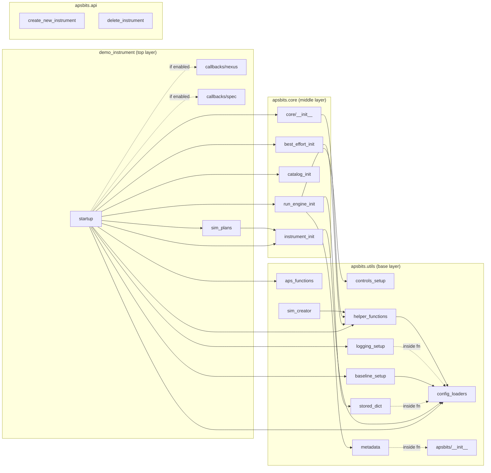
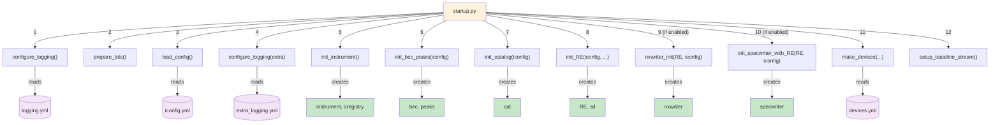

# APSBITS: Template Package for Bluesky Instruments

| PyPI | Coverage |
| --- | --- |
[](https://pypi.python.org/pypi/apsbits) | [](https://coveralls.io/github/BCDA-APS/BITS?branch=main) |

BITS: **B**luesky **I**nstrument **T**emplate **S**tructure

Template of a Bluesky Data Acquisition Instrument in console, notebook, &
queueserver.

## Production use of BITS

Please create a bits instrument using our template repository: https://github.com/BCDA-APS/DEMO-BITS


## Installing the BITS Package

```bash
export INSTALL_ENVIRONMENT_NAME=apsbits_env
conda create -y -n "${INSTALL_ENVIRONMENT_NAME}" python=3.11 pyepics
conda activate "${INSTALL_ENVIRONMENT_NAME}"
pip install apsbits
```

Or with [uv](https://docs.astral.sh/uv/):

```bash
uv pip install apsbits      # into an active environment
# ...or, from a clone for development (uses the committed uv.lock):
uv sync --extra dev
```

For development please reference our documentation

## Startup Architecture

When a user runs `from apsbits.demo_instrument.startup import *`, the following
import and initialization sequence executes. No module runs code on import.
All initialization flows through `startup.py` via explicit function calls.

### Module Dependency Graph

Arrows show import direction. No circular imports exist.



Solid arrows = module-level imports. Dashed arrows = conditional or function-level imports.

### Initialization Sequence

Everything is called explicitly by `startup.py` in this order:


Purple = YAML config files read from disk. Green = objects available in your session.

## Testing the apsbits base installation

On an ipython console

```py
from apsbits.demo_instrument.startup import *
listobjects()
RE(sim_print_plan())
RE(sim_count_plan())
RE(sim_rel_scan_plan())
```
